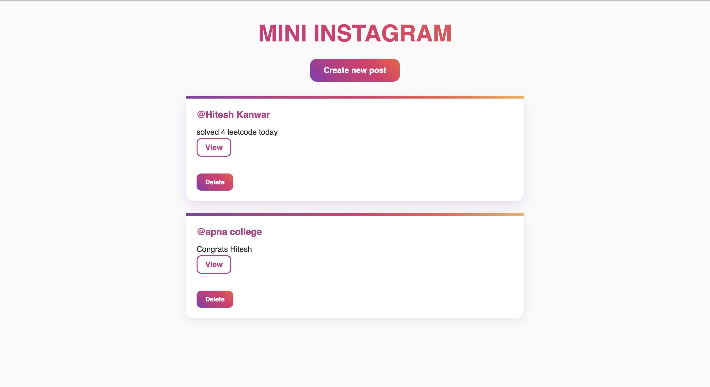
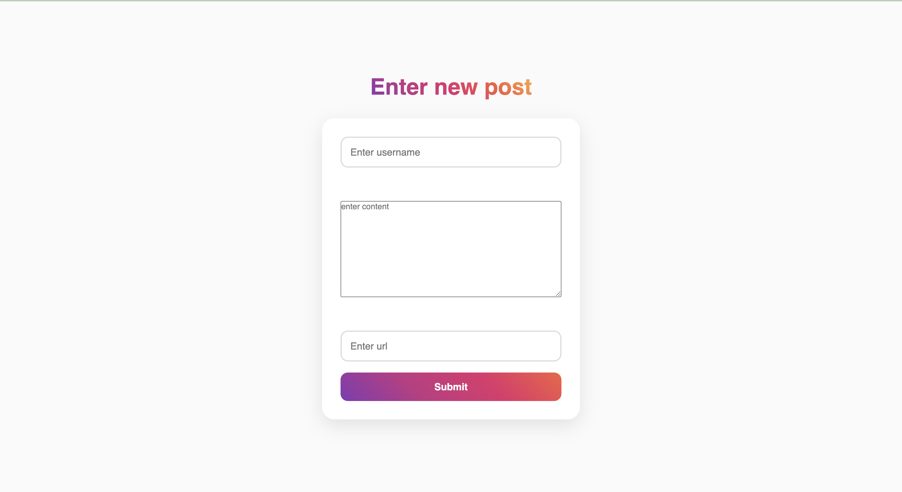
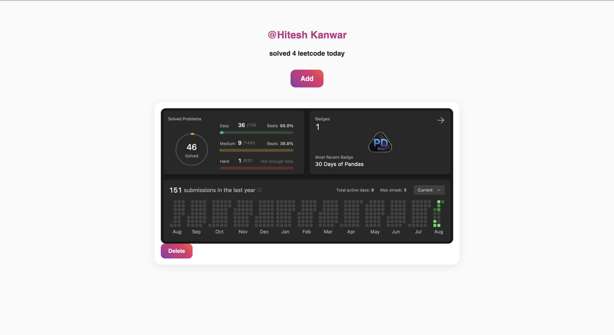

# 📸 Mini Instagram Clone

A simple Instagram-inspired CRUD web application built using **Node.js**, **Express.js**, **MongoDB**, **Mongoose**, and **EJS**.

Users can create posts, upload image URLs, view posts, add multiple images to a post, and delete posts or individual images.

---


## 📷 Screenshots

| Home Page | Create Post |
|------------|-------------|
|  |  |

### View Post



---
## 🌐 Live Demo

Coming Soon...

---

## 🚀 Features

* Create a new post
* View all posts
* View individual post
* Add multiple images to a post
* Delete individual images
* Delete entire post
* Responsive UI using CSS
* MongoDB database integration

---

## 🛠 Tech Stack

### Backend

* Node.js
* Express.js
* MongoDB
* Mongoose

### Frontend

* EJS
* HTML5
* CSS3

### Other Packages

* Method Override
* UUID

---

## 📂 Project Structure

```text
Mini-Instagram/
│
├── models/
│   └── insta.js
│
├── public/
│   ├── style.css
│   ├── new.css
│   └── show.css
│
├── views/
│   ├── home.ejs
│   ├── new.ejs
│   ├── show.ejs
│   └── edit.ejs
│
├── index.js
├── init.js
├── package.json
└── README.md
```

---

## ⚙️ Installation

### Clone the repository

```bash
git clone https://github.com/hiteshkanwar41/mini-instagram.git
```

### Go inside the project

```bash
cd mini-instagram
```

### Install dependencies

```bash
npm install
```

### Start MongoDB

Make sure MongoDB is running locally.

```
mongodb://127.0.0.1:27017/instagram
```

### Seed the database (Optional)

```bash
node init.js
```

### Run the project

```bash
node index.js
```

Open your browser and visit:

```
http://localhost:8080/posts
```

---

## 📌 Routes

| Method | Route                          | Description            |
| ------ | ------------------------------ | ---------------------- |
| GET    | /posts                         | Show all posts         |
| GET    | /posts/new                     | Create post page       |
| POST   | /posts                         | Create a new post      |
| GET    | /posts/:id                     | View a single post     |
| GET    | /posts/:id/edit                | Add image page         |
| PATCH  | /posts/:id                     | Add an image to a post |
| DELETE | /posts/:id                     | Delete a post          |
| DELETE | /posts/:postId/images/:imageId | Delete an image        |

---

## 🚀 Future Improvements

* User authentication
* Login & Signup
* Image uploads using Cloudinary
* Like system
* Comments
* Edit post content
* Responsive design improvements
* REST API version
* Pagination

---

## 📚 Learning Outcomes

This project helped me learn:

* Express.js routing
* CRUD operations
* RESTful architecture
* MongoDB & Mongoose
* Method Override
* EJS templating
* MVC folder structure
* Dynamic routing
* Database modeling

---

## 👨‍💻 Author

**Hitesh Kanwar**


GitHub: [@hiteshkanwar41](https://github.com/hiteshkanwar41)

